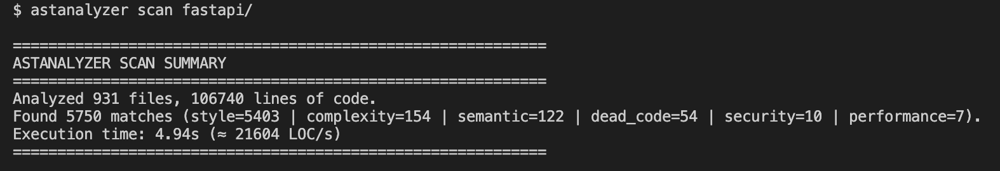
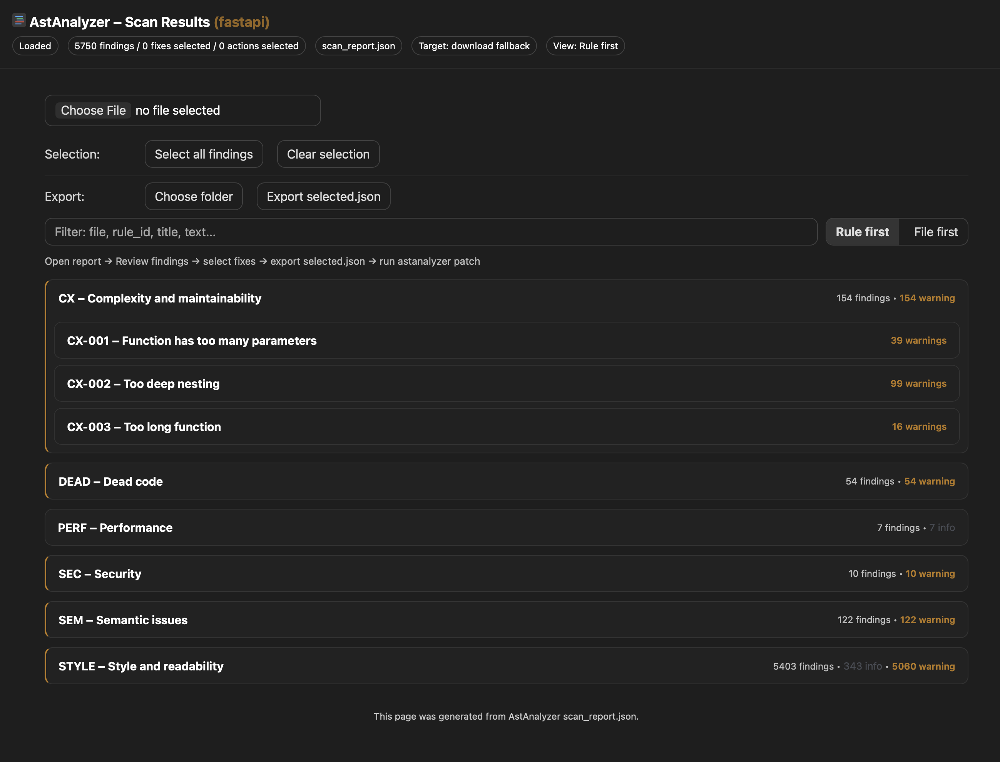
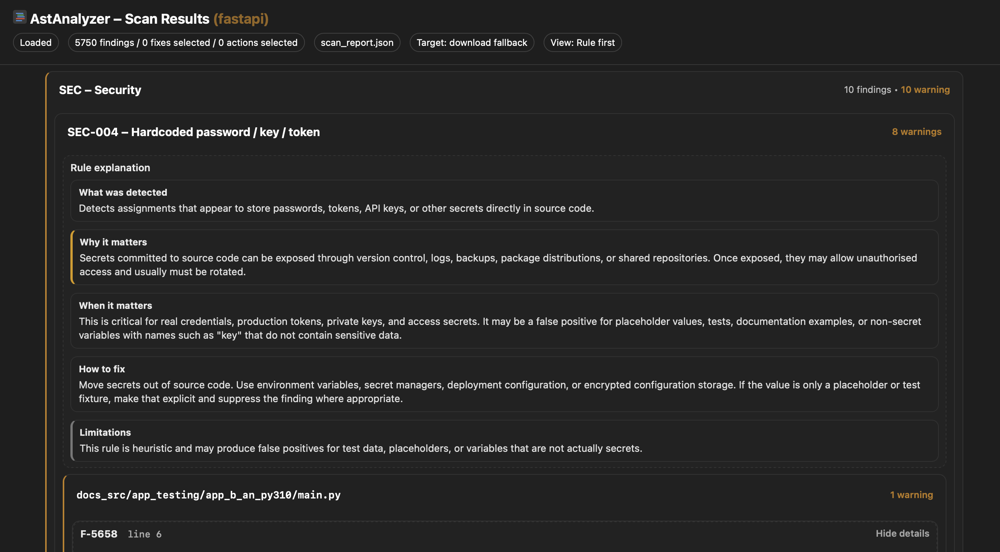
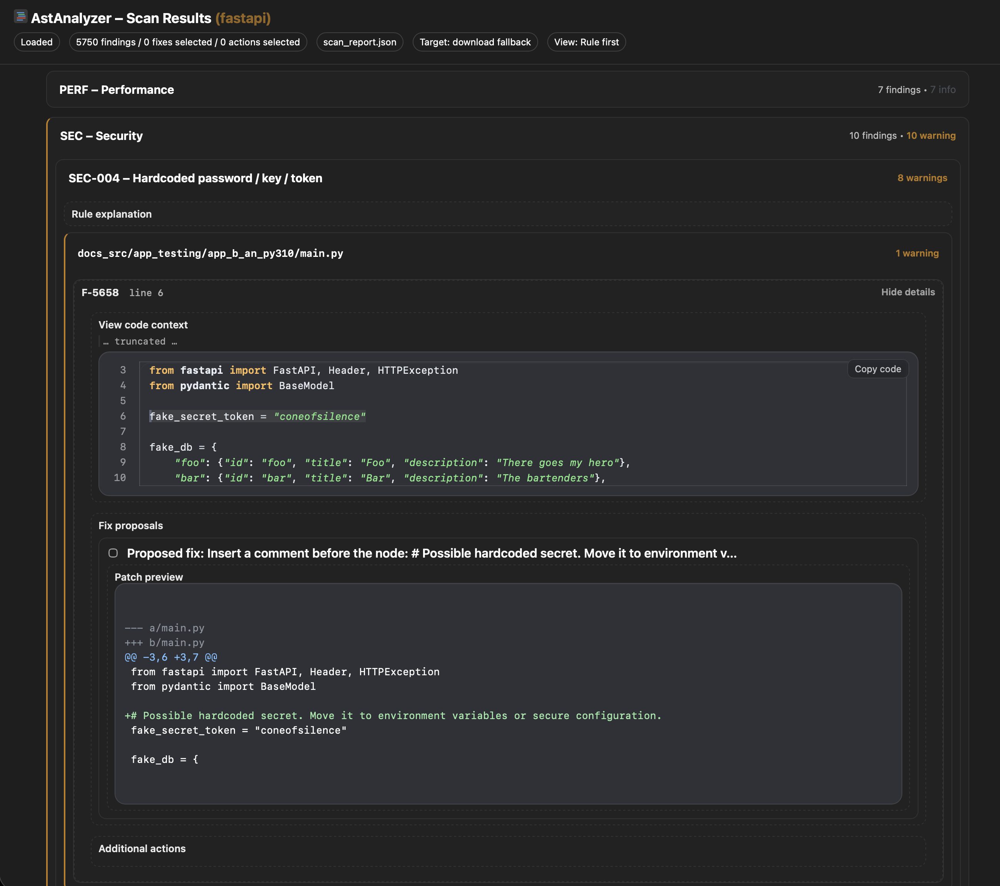
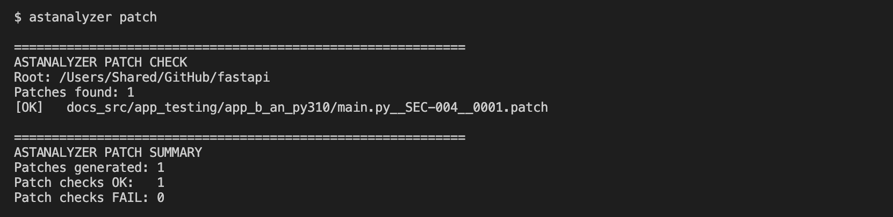
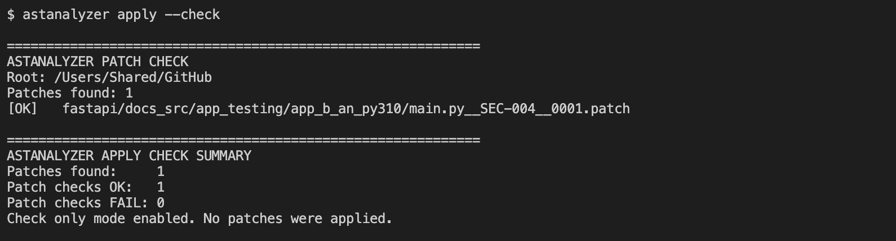
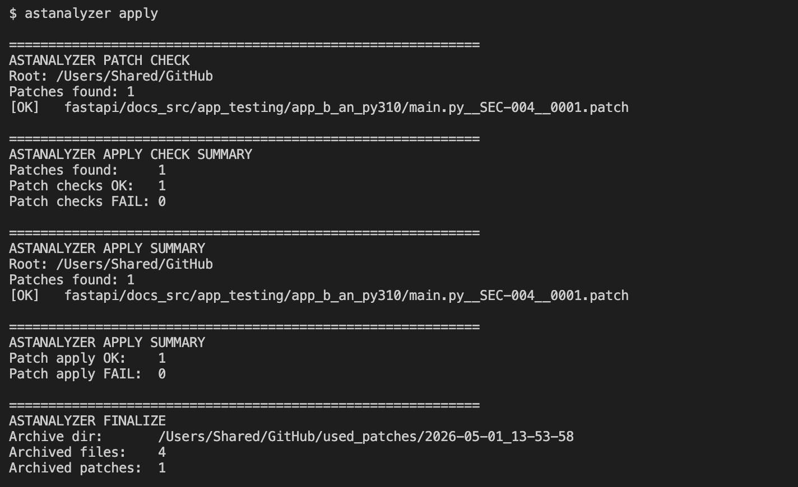
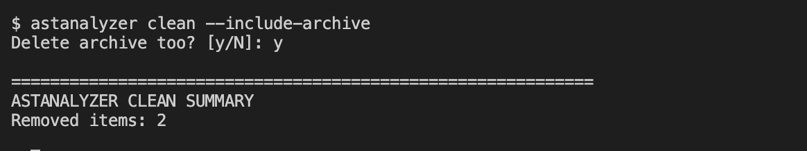
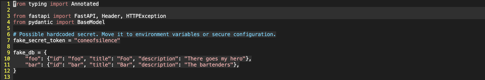

[Back to README](../README.md) | [Next: Getting Started](getting-started.md)

## Example Report

This section demonstrates how AstAnalyzer presents analysis results across both CLI and the interactive HTML report.

---

### CLI Scan Summary

The command-line interface provides a high-level summary of the analysis, including file count, total findings, category distribution, and performance metrics.

---

### Report Overview

The HTML report provides an interactive overview of all detected findings, grouped by category and rule. It allows fast navigation and prioritisation.

---

### Rule Detail

Rules include structured explanations using the WHAT / WHY / WHEN / HOW / LIMITATIONS model, helping users understand both the issue and its impact.

---

### Finding Detail

Each finding includes a contextual code preview, precise location, and structured explanation to support quick understanding and validation.

---

## Patch Workflow (CLI)

### Patch Generation

*Figure: Patch generation step showing detected patches and validation results.*

---

### Patch Validation (Dry Run)

*Figure: Dry-run mode verifies that patches can be applied without modifying files.*

---

### Patch Application

*Figure: Successful patch application followed by archiving of processed files.*

---

### Cleanup

*Figure: Cleanup operation removing generated files and optional archive.*

---

### Result Verification

*Figure: Example of an applied fix resolving a detected security issue (hardcoded secret).*

---

[Back to README](../README.md) | [Next: Getting Started](getting-started.md)