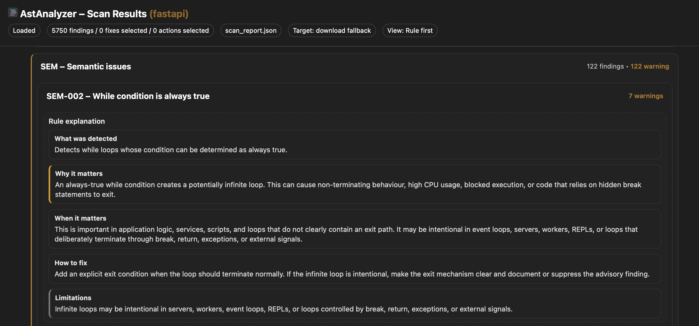

[Back to README](../README.md) | [Next: Getting Started](getting-started.md)

## Example Report

This section demonstrates how AstAnalyzer presents analysis results across CLI and interactive report UI.

### CLI Summary

The command-line interface provides a quick high-level summary of the analysis, including file count, total findings, category distribution, and performance metrics.

---

### Overview

The HTML report provides an interactive overview of all detected findings, grouped by category and rule. It allows fast navigation and prioritization.

---

### Finding Detail

Each finding includes contextual code preview, precise location, and structured explanation to support quick understanding and validation.

---

### Rule Detail

Rules include detailed explanations structured as WHAT / WHY / WHEN / HOW / LIMITATIONS, helping users understand not only the issue but also its impact and resolution.

[Back to README](../README.md) | [Next: Getting Started](getting-started.md)